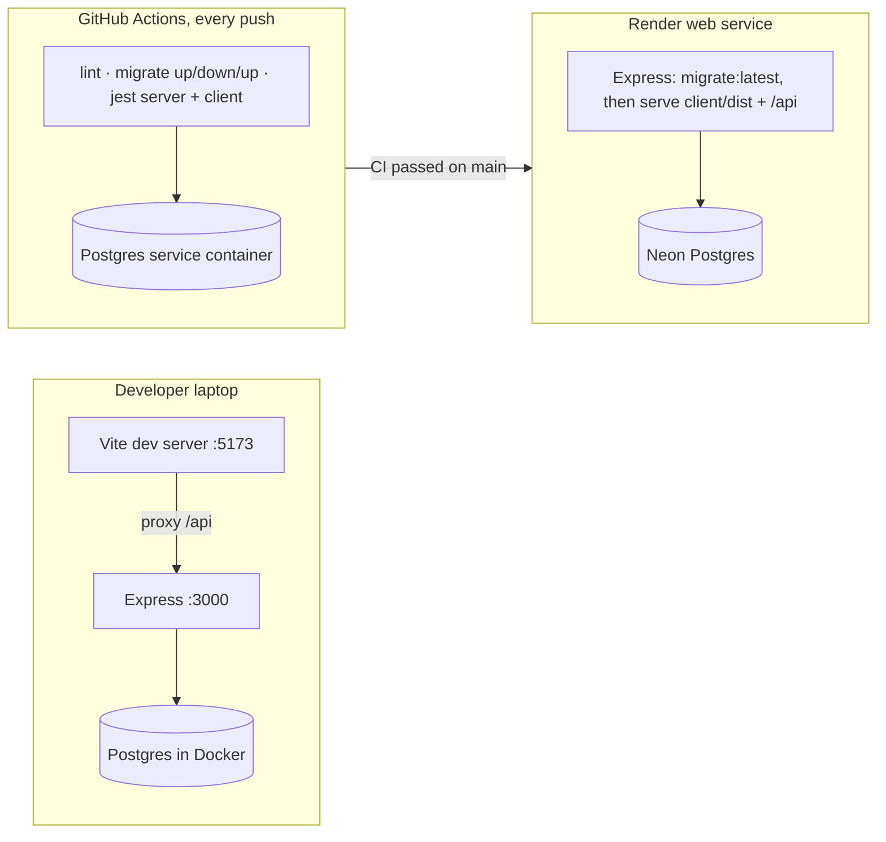
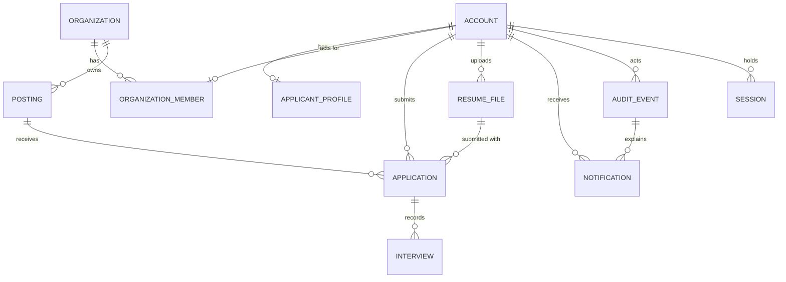

# Capability Map and Structural Seed

The map is the consistency auditor's checklist: every use case, its business modules, its iteration, and the ARCH rules that govern it. Module names are seed; the rule (ARCH-04) is one module per use-case action, not this exact list. The diagrams are scaffold; the code owns the detail once written.

## Capability → Architecture

| Use case (iteration) | Business modules under `server/src/business/` | Governed by |
| --- | --- | --- |
| UC-A2 (1) | `postings/listLivePostings`, `postings/getPosting` | ARCH-11, ARCH-15, S10 |
| UC-R2 (1) | `postings/createPosting`, `editPosting`, `deletePosting`, `submitPosting`, `closePosting`, `listOrgPostings` | ARCH-10, ARCH-12, ARCH-13, ARCH-15 |
| UC-M1 (1) | `admin/listRecruiterRequests`, `admin/reviewRecruiterRequest` | ARCH-12, ARCH-13, ARCH-18 (membership) |
| FR-X-1..5 (1) | `accounts/login`, `logout`; `middleware/auth.js`, guards (S7); `notifications/listNotifications`, `unreadCount` (FR-X-3 delivery, so UJ-2 is demonstrable at Iteration 2); `persistence/auditRepository`, `notificationRepository`; base and demo seeds (ARCH-20) | ARCH-08, ARCH-09, ARCH-10, ARCH-13, ARCH-14, ARCH-19 |
| UC-A1 (2) | `accounts/registerApplicant`, `profiles/updateProfile`, `profiles/uploadResume`, `profiles/getMyResume` | ARCH-08, ARCH-17 |
| UC-A3, UC-A4 (2) | `applications/submitApplication`, `listMyApplications`, `getMyApplication`, `withdrawApplication` | ARCH-01, ARCH-12, ARCH-13, ARCH-15, ARCH-17, ARCH-18 |
| UC-R1 (2) | `organizations/requestRecruiter`, `organizations/updateOrganization`, `organizations/getMyRecruiterStatus` | ARCH-10, ARCH-18 (membership) |
| UC-R3 (2) | `applications/listOrgApplications`, `getOrgApplication`, `getSubmittedResume` | ARCH-10, ARCH-11, ARCH-17, S10 |
| UC-R4 (2) | `applications/advanceApplication`, `rejectApplication` | ARCH-10, ARCH-12, ARCH-13, ARCH-14, ARCH-19 |
| UC-M2 (2) | `admin/listPendingPostings`, `admin/reviewPosting`, `admin/closePosting` | ARCH-12, ARCH-13, ARCH-15 |
| UC-A5 (3) | `notifications/markRead`; `applications/acceptOffer` (the ARCH-13 cascade), `declineOffer`; Notification pages on top of FR-X-3 delivery | ARCH-12, ARCH-13, ARCH-14, ARCH-18 |
| UC-R5 (3) | `applications/recordInterview`, `recordInterviewOutcome` | ARCH-10, ARCH-13, ARCH-18 |
| UC-R6 (3) | `applications/extendOffer` | ARCH-01, ARCH-10, ARCH-12, ARCH-13 |
| UC-M3 (3) | `admin/listAccounts`, `suspendAccount`, `reactivateAccount`, `changeRole` | ARCH-08, ARCH-13, ARCH-19 |
| UC-M4 (3) | `admin/updateSettings`, `updateReferenceData`, `updateStageLabels`, `oversightCounts`, `viewRecordHistory` | ARCH-13, ARCH-15, ARCH-19 |

Notes. `postings/closePosting` (Recruiter, own Organization, no reason) and `admin/closePosting` (any Live Posting, reason, notifies the Recruiter) share `postingRepository.transition` and differ only in actor scope and Notification. `acceptOffer` calls `applicationRepository.rejectAllActiveForPosting` for the cascade; it never imports `rejectApplication`.

## Environments (ARCH-02, ARCH-16)



## Core entities (ARCH-18, ARCH-19)



Reference tables not drawn: `settings`, `categories`, `locations`, `stage_labels`. Column detail is in `SHAPES.md` S2.

## Source tree (ARCH-04)

```text
careerbridge-csi5324/
  package.json                     # npm workspaces: server, client
  docker-compose.yml  Dockerfile   # Postgres for dev; one production image
  .github/workflows/ci.yml
  server/
    knexfile.js
    src/
      config.js                    # the only reader of process.env
      presentation/                # app.js, routes/{public,auth,me,org,admin}.js, middleware/auth.js, errors.js
      business/
        errors.js                  # S9 classes
        domain/                    # enums.js, postingStatus.js, applicationStage.js (pure)
        <area>/<verbNoun>.js       # + <verbNoun>.test.js beside it
      persistence/                 # db.js (knex, pool, withTransaction), <entity>Repository.js, testSupport.js
      data/
        migrations/                # <timestamp>_<name>.js
        seeds/base/  seeds/demo/
    test/factories.js
  client/src/
    config.js  api.js  auth/useAuth.jsx  notifications/href.js  components/ErrorAlert.jsx  pages/
```

## Demo seed cast (ARCH-20, `seeds/demo/`)

Acme Waco (Approved) with Sam (Approved Recruiter); Bear Staffing (Pending Approval) with Priya (Pending, for UC-M1); Maria and Devon (Applicants with profiles and resumes); one Live and one already-expired Posting for Acme; the seeded Administrator comes from `seeds/base/`. Until UC-R1 and UC-A1 ship in Iteration 2, this seed is the only source of Recruiter and Applicant Accounts, so `SEED_DEMO=true` is set on the deployed demo as well as in development and CI (S11).
